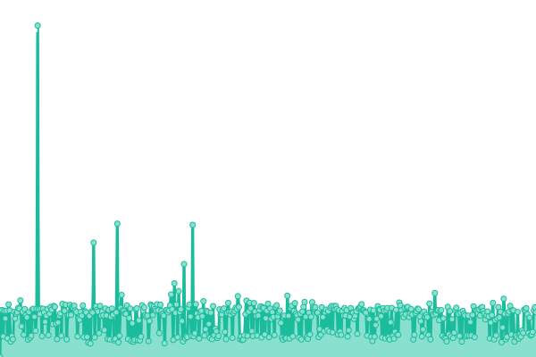
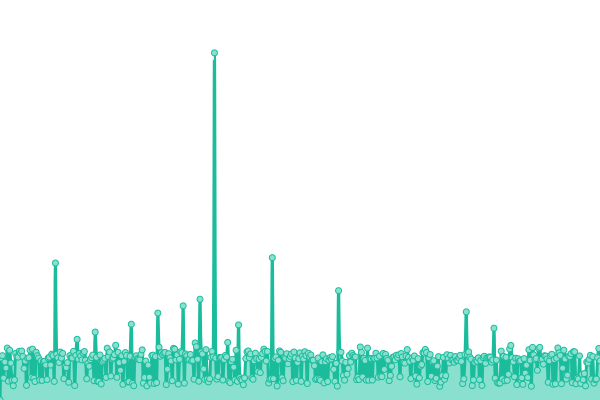
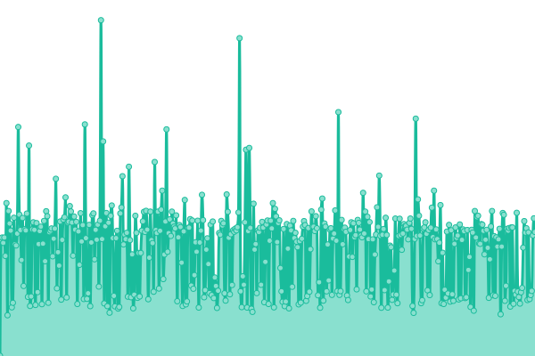
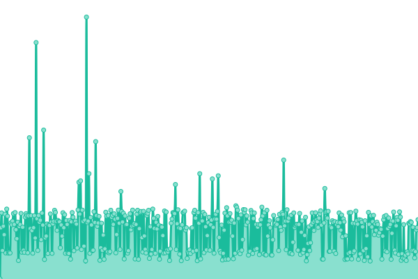
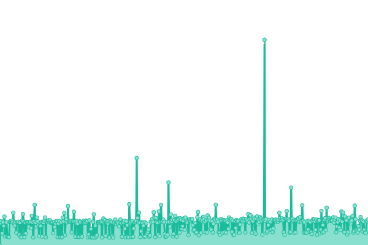
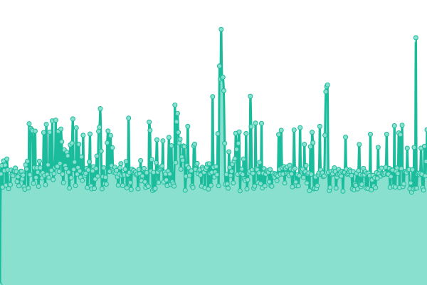

# [📈 Live Status](https://SRESchool.github.io/AllHolidaylandmark-monitor-upptime): <!--live status--> **🟧 Partial outage**

This repository contains the open-source uptime monitor and status page for [SRESchool](https://SRESchool.github.io/AllHolidaylandmark-monitor-upptime), powered by [Upptime](https://github.com/upptime/upptime).

With [Upptime](https://upptime.js.org), you can get your own unlimited and free uptime monitor and status page, powered entirely by a GitHub repository. We use [Issues](https://github.com/SRESchool/AllHolidaylandmark-monitor-upptime/issues) as incident reports, [Actions](https://github.com/SRESchool/AllHolidaylandmark-monitor-upptime/actions) as uptime monitors, and [Pages](https://SRESchool.github.io/AllHolidaylandmark-monitor-upptime) for the status page.

<!--start: status pages-->
<!-- This summary is generated by Upptime (https://github.com/upptime/upptime) -->
<!-- Do not edit this manually, your changes will be overwritten -->
<!-- prettier-ignore -->
| URL | Status | History | Response Time | Uptime |
| --- | ------ | ------- | ------------- | ------ |
|  [Bangalore Orbit](https://bangaloreorbit.com) | 🟩 Up | [bangalore-orbit.yml](https://github.com/SRESchool/AllHolidaylandmark-monitor-upptime/commits/HEAD/history/bangalore-orbit.yml) | 

 550ms
     
 | 

<a href="https://SRESchool.github.io/AllHolidaylandmark-monitor-upptime/history/bangalore-orbit">10.46%</a>
    

|  [Bhopal Orbit](https://bhopalorbit.com) | 🟩 Up | [bhopal-orbit.yml](https://github.com/SRESchool/AllHolidaylandmark-monitor-upptime/commits/HEAD/history/bhopal-orbit.yml) | 

 570ms
     
 | 

<a href="https://SRESchool.github.io/AllHolidaylandmark-monitor-upptime/history/bhopal-orbit">10.46%</a>
    

|  [Gujarat  Gujarat Orbit](https://gujaratorbit.com) | 🟩 Up | [gujarat-gujarat-orbit.yml](https://github.com/SRESchool/AllHolidaylandmark-monitor-upptime/commits/HEAD/history/gujarat-gujarat-orbit.yml) | 

 564ms
     
 | 

<a href="https://SRESchool.github.io/AllHolidaylandmark-monitor-upptime/history/gujarat-gujarat-orbit">10.47%</a>
    

|  [Chennai Orbit](https://chennaiorbit.com) | 🟩 Up | [chennai-orbit.yml](https://github.com/SRESchool/AllHolidaylandmark-monitor-upptime/commits/HEAD/history/chennai-orbit.yml) | 

 292ms
     
 | 

<a href="https://SRESchool.github.io/AllHolidaylandmark-monitor-upptime/history/chennai-orbit">10.47%</a>
    

|  [Holiday Landmark](https://holidaylandmark.com) | 🟥 Down | [holiday-landmark.yml](https://github.com/SRESchool/AllHolidaylandmark-monitor-upptime/commits/HEAD/history/holiday-landmark.yml) | 

 0ms
     
 | 

<a href="https://SRESchool.github.io/AllHolidaylandmark-monitor-upptime/history/holiday-landmark">0.00%</a>
    

|  [Kerala Orbit](https://keralaorbit.in) | 🟩 Up | [kerala-orbit.yml](https://github.com/SRESchool/AllHolidaylandmark-monitor-upptime/commits/HEAD/history/kerala-orbit.yml) | 

 514ms
     
 | 

<a href="https://SRESchool.github.io/AllHolidaylandmark-monitor-upptime/history/kerala-orbit">10.48%</a>
    

|  [Mera Apna Bihar](https://meraapnabihar.com) | 🟩 Up | [mera-apna-bihar.yml](https://github.com/SRESchool/AllHolidaylandmark-monitor-upptime/commits/HEAD/history/mera-apna-bihar.yml) | 

 2908ms
     
 | 

<a href="https://SRESchool.github.io/AllHolidaylandmark-monitor-upptime/history/mera-apna-bihar">10.48%</a>
    

|  [Mumbai Orbit](https://mumbaiorbit.in) | 🟥 Down | [mumbai-orbit.yml](https://github.com/SRESchool/AllHolidaylandmark-monitor-upptime/commits/HEAD/history/mumbai-orbit.yml) | 

 0ms
     
 | 

<a href="https://SRESchool.github.io/AllHolidaylandmark-monitor-upptime/history/mumbai-orbit">0.00%</a>
    

<!--end: status pages-->

[**Visit our status website →**](https://SRESchool.github.io/AllHolidaylandmark-monitor-upptime)

## 📄 License

- Powered by: [Upptime](https://github.com/upptime/upptime)
- Code: [MIT](./LICENSE) © [Anand Chowdhary](https://anandchowdhary.com), supported by [Pabio](https://pabio.com)
- Data in the `./history` directory: [Open Database License](https://opendatacommons.org/licenses/odbl/1-0/)
